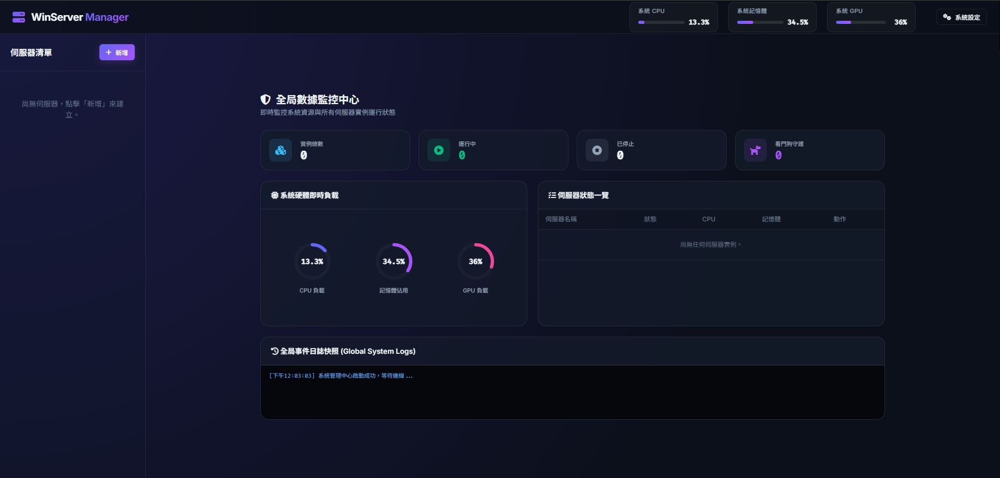

# 🖥️ WinServer Manager 伺服器管控系統

WinServer Manager 是一款專為 Windows 環境量身打造的輕量化、集中式伺服器管控與維運解決方案。本系統結合了即時系統監控、強健的安全防護機制、高效的內容定址去重備份，以及多執行個體（Instances）生命週期管理，旨在為伺服器管理員提供直覺、穩定且安全的自動化維運體驗。



---

## ✨ 核心特色與亮點

### 1. 📊 全方位的即時監控中心
* **硬體狀態即時視覺化**：整合系統 CPU、記憶體、硬碟使用率，並針對 NVIDIA 顯示卡自動進行 GPU 與顯存使用率監控（自動呼叫 `nvidia-smi`）。
* **實例效能監控**：即時呈現各伺服器實例獨立的 CPU 與記憶體使用率，便於迅速辨識異常佔用資源的程式。

### 2. 🛡️ 企業級安全防護設計 (Security First)
* **Windows DPAPI 加密技術**：系統的敏感金鑰（如 Discord Webhook Token）均整合了 Windows 原生的 DPAPI 加密機制，以加密 Base64 格式儲存於本地。即使設定檔遭竊，亦無法於其他電腦上解密。
* **API 敏感資訊遮罩**：所有 API 傳輸的憑證資訊在回傳至前端前均會自動實施中間遮罩遮蔽（如 `MTIz...********...OQ==`），防範開發者工具或網路攔截洩漏憑證。
* **嚴格的路徑穿越防禦 (Anti-Path Traversal)**：檔案系統管理（如檔案瀏覽、上傳、解壓）與備份還原流程皆具備安全路徑校驗，防止 `../` 惡意路徑穿越攻擊。

### 3. 💾 高效 Git 內容定址去重備份系統 (Content-Addressable Backup)
* **檔案層級去重**：採用類似 Git 的去重架構，將備份檔案內容計算 SHA-256 雜湊後儲存於全局物件庫（Objects Store），相同的檔案內容在硬碟中僅會儲存一份，大幅節省儲存空間。
* **兩階段還原原子性保護**：備份還原採取「暫存目錄還原 -> 移動舊檔 -> 移動新檔」的兩階段機制，並具備異常自動回滾（Rollback）設計。即使還原中途斷電或程式崩潰，原伺服器檔案亦能完好無損，防範資料損毀。
* **孤兒物件垃圾回收 (GC)**：內建備份垃圾回收機制，刪除備份版本後可一鍵回收不再被引用的實體檔案，極大化磁碟空間釋放。

### 4. ⏰ 智慧定時排程與看門狗 (Watchdog & Scheduler)
* **無感防護看門狗**：可為伺服器獨立啟用「看門狗守護」，當偵測到進程異常退出時，自動發送 Discord 警報並於冷卻時間後自動重啟。
* **強健的定時重啟/備份/指令排程**：支援排程指令發送、定時重啟或定時備份。排程器採用記憶體快取設計以優化磁碟 I/O，且當伺服器處於手動停止狀態時會自動略過排程任務，不干擾手動操作。

### 5. 🔌 斷線防護與日誌容錯
* **全域離線警告橫幅**：前端透過 WebSocket 與 API 輪詢監聽後端狀態，若後端服務暫時重啟或離線，前端會立即彈出紅色警告橫幅並暫停請求，連線回復後自動無縫恢復。
* **智慧日誌編碼相容性 (C-4)**：伺服器控制台日誌讀取全面重構為二進位讀取模式，智慧嘗試 `UTF-8`、`CP950` 與 `GBK` 解碼，並具備 `errors='replace'` 容錯保底，確保永遠不會因為特殊字元或編碼錯誤導致日誌執行緒崩潰。

---

## 🏗️ 系統技術棧
* **後端架構**：Python 3 / FastAPI (ASGI web framework) / Uvicorn / Pywin32 / Psutil
* **前端架構**：Vanilla HTML5 / Vanilla CSS3 / Vanilla Javascript (ES6) (無第三方框架依賴，極速響應)

---

## 🚀 快速開始 (開發與除錯)

### 1. 安裝環境依賴
本專案建議在虛擬環境 (venv) 下執行。請於專案目錄下啟用您的虛擬環境後安裝依賴：
```powershell
pip install -r backend/requirements.txt
```

### 2. 啟動服務
```powershell
python backend/main.py
```
啟動後，請在瀏覽器中訪問：[**http://127.0.0.1:8000**](http://127.0.0.1:8000) 即可進入管控系統。

---

## 📦 生產環境打包與部署指南 (PyInstaller)

本專案提供了預先設定好的 [main.spec](main.spec) 打包描述檔，支援將後端編譯為單一資料夾模式 (onedir)，並將前端靜態資源與執行檔抽離，方便您日後隨時修改前端網頁。

### 1. 打包指令
在啟用虛擬環境的終端機下執行：
```powershell
pyinstaller --clean main.spec
```

### 2. 部署目錄結構 (打包後執行)
打包完成後會於 `dist/main/` 生成執行檔。**因為前端靜態資源是另外放置，您必須將 `frontend/` 資料夾手動複製放置於 `dist/main/` 底下**。

部署時的最終結構如下：
```text
dist/main/
├── main.exe              # Windows 伺服器管理器執行檔
├── frontend/             # 前端網頁目錄 (手動複製至此)
│   ├── css/
│   ├── js/
│   └── index.html
├── logo.ico              # 圖示檔案
├── _internal/            # Python 內部依賴與 Pywin32 二進位檔
└── ... (其餘 dll 依賴)
```
啟動 `main.exe`，系統便會在此目錄下自動建立 `servers/` (實例數據)、`backups/` (去重備份) 與 `global_config.json` (Discord 設定檔)。

---

## 📄 開源授權與合規宣告
本專案採用 [MIT License](LICENSE) 進行授權。

本專案所包含或依賴的第三方開源套件均為 Permissive Licenses (MIT, BSD, Apache 2.0)，對商業發行與部署極度友善。依據各套件的授權條款要求，相關套件的完整版權聲明與授權文件副本已彙整於 [THIRD-PARTY-LICENSES.md](THIRD-PARTY-LICENSES.md)。

---

## 🤖 開發聲明
* **AI 協作開發**：本專案之所有程式碼、配置設定與相關說明文件皆由 AI 編寫與設計完成。
