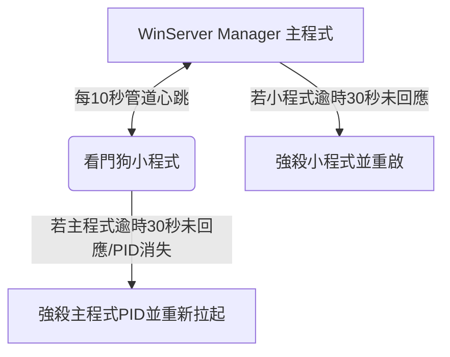

# 🖥️ WinServer Manager 系統開機自啟與雙守護看門狗機制指南

為了確保 WinServer Manager 管控系統在**電腦重新開機**或**管理器本體意外卡死/當機**時，能夠完全自主恢復運行並重建所有伺服器實例的狀態，本系統內建了以下自癒機制。

---

## 1. ⚙️ 開機自動啟動 (Windows Registry)

本系統使用 Windows 註冊表 (Windows Registry) 的 `Software\Microsoft\Windows\CurrentVersion\Run` 機制來實現開機自啟動。

### 運作原理
* **路徑自癒**：每次 WinServer Manager 啟動時，都會自動檢測當前的執行路徑，並重寫註冊表。如果管理員移動了專案資料夾的位置，只需要手動點擊執行一次，開機自啟路徑便會自動修復。
* **網頁控制開關**：可在系統的「全域設定」中，勾選或取消「開機自動啟動」選項，系統會自動在註冊表中寫入或刪除啟動項。
* **環境相容**：
  * **打包後**：自動註冊 `main.exe` 絕對路徑。
  * **開發環境**：自動註冊 `python.exe "main.py的路徑"`。

---

## 2. 🐕 雙向心跳看門狗小程式 (helper_watchdog)

為了防範主程式卡死、無響應或意外崩潰，系統採用了**雙守護進程 (Double Daemon)** 的心跳防護設計。

### 通訊機制 (管道 Stdin/Stdout)
看門狗小程式 (`helper_watchdog.py` 或 `helper_watchdog.exe`) 的啟動完全由主程式控制。主程式啟動時，會透過 `stdin` 與 `stdout` 管道拉起小程式。
* **無 Port 佔用**：不佔用任何 TCP/UDP 連接埠，絕不發生 Port 衝突，也**不會觸發 Windows 防火牆的警告阻擋視窗**。
* **雙向心跳流程**：
  1. 主程式每 **10 秒** 向小程式發送一次 `"ping\n"` 訊號。
  2. 小程式收到後，立刻回覆 `"pong\n"` 訊號。
  3. **小程式監控**：若超過 **30 秒** 沒有收到心跳，或是偵測到主程式的 PID 已消失，小程式會強制關閉主程式 PID（釋放被佔用的 Port），並使用相同的啟動參數重新啟動主程式，隨後小程式自毀退出。
  4. **主程式監控**：若小程式超過 **30 秒** 沒有回覆 `"pong"`，或是小程式進程意外結束，主程式會強制結束舊的小程式並重新拉起一個新的看門狗小程式。
  5. **安全退出**：當主程式被管理員正常關閉時，會透過管道向小程式發送 `"exit\n"`，小程式接收後會乾淨退出，不會殘留在背景中。

---

## 3. 💾 伺服器實例狀態自動恢復 (Auto-Resume)

當 WinServer Manager 因上述任何原因（電腦重開機、主程式卡死重啟）重新啟動時，它會自動將原本正在運行的伺服器實例恢復到重開前的狀態。

* **狀態持久化**：管理員在網頁上按下「啟動」或「停止」實例時，系統會將伺服器實例的運行狀態 (`should_be_running: true/false`) 即時寫入該實例目錄下的 `config.json` 中。
* **無縫恢復**：WinServer Manager 每次啟動並初始化監控模組時，會自動遍歷所有實例，如果發現某個實例的 `should_be_running` 為 `true`，就會在背景執行緒中自動調用 `server.start()` 重新將其拉起，管理員無需手動干預。
